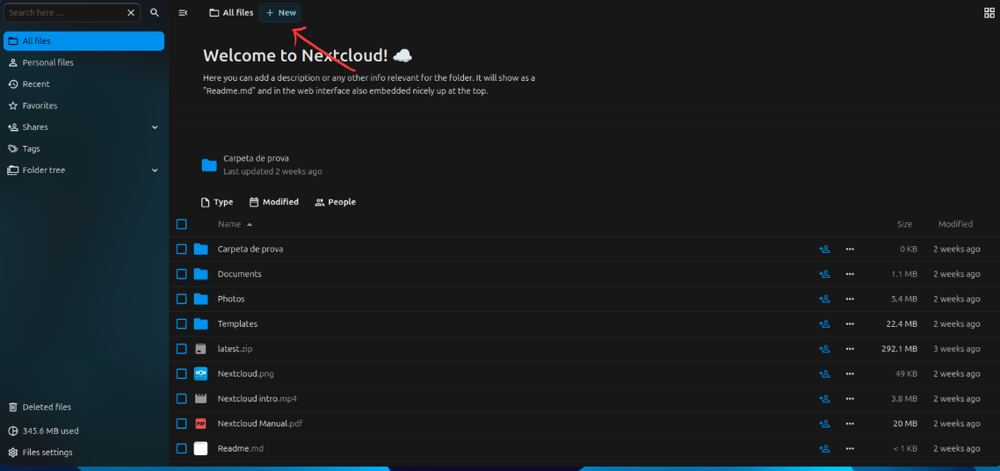
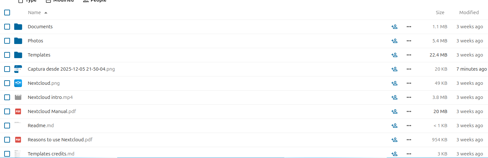
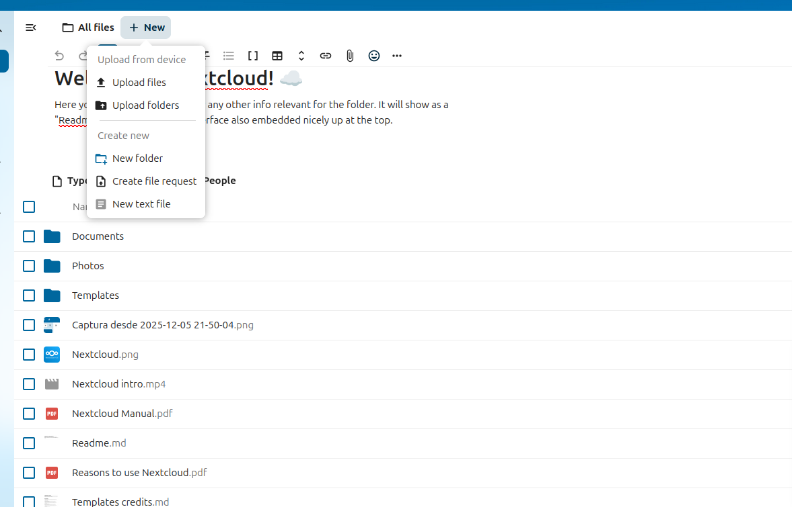
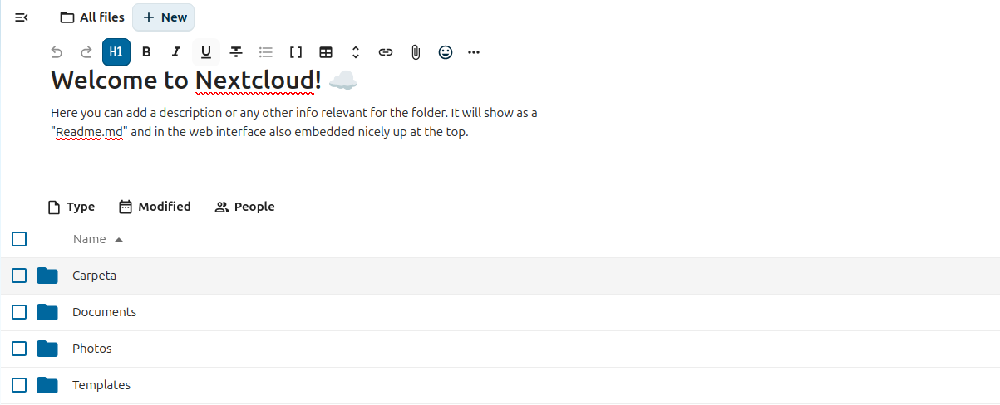
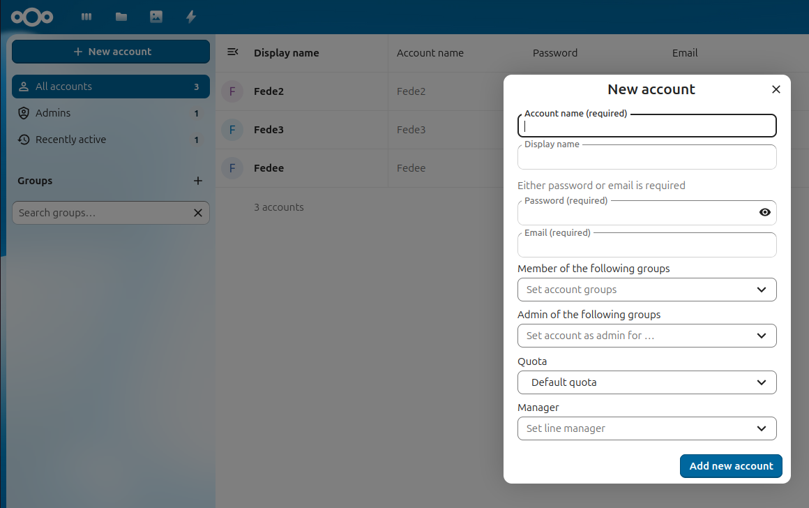
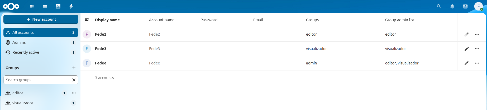
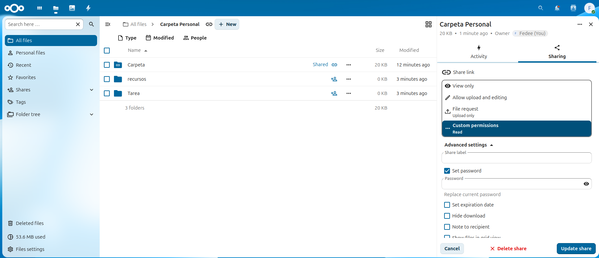

# 📂 Guía de demostración y administración de Nextcloud

Esta guía documenta cómo usar y administrar un servidor Nextcloud: subir archivos, crear usuarios, asignar permisos y acceder desde cualquier equipo de la red.

## 1️⃣ Demostración del funcionamiento
### 1.1 Subir archivos

### Accede a tu cuenta de Nextcloud.

### Haz clic en “Subir archivo” o arrastra un documento o imagen al navegador.

### Verifica que el archivo aparece correctamente en la lista de archivos.

### 1.2 Crear carpetas

Haz clic en “Nueva carpeta” dentro de tu espacio de usuario.

Crea una estructura básica, por ejemplo:

Documentos

Imágenes

Compartidos

### 1.3 Compartir contenidos

Selecciona un archivo o carpeta y haz clic en “Compartir”.

Puedes generar un enlace público o compartir directamente con otro usuario de Nextcloud.

Configura opciones como contraseña o fecha de caducidad si es necesario.

## 2️⃣ Creación de usuarios
### Crear tres usuarios

Accede a la interfaz de administración de Nextcloud.

Crea tres usuarios:

Administrador → control total.

Editor → puede modificar archivos y carpetas.

Visualizador → solo puede ver archivos.

## 3️⃣ Asignación de roles y permisos
### Configurar permisos por rol

Administra los permisos desde la interfaz de Nextcloud:

Administrador: todo acceso.

Editor: puede añadir, editar y borrar archivos.

Visualizador: solo lectura.

### Al entrar en la carpeta con una cuenta diferente la experiencia cambia gracias a los permisos.

## 4️⃣ Administración de archivos
### 4.1 Organización de carpetas y archivos

Crea una jerarquía lógica dentro del Nextcloud:

-Documentos Personales

-Carpeta

-Recursos

## 5️⃣ Acceso desde otra máquina de la red
Nextcloud permite que cada usuario pueda montar el almacenamiento de otro usuario como si fuera una carpeta compartida, siempre que ambos lo permitan y tengan las credenciales necesarias. Esto se hace mediante la app External Storage Support (“Almacenamiento externo”).

🔧 1. Activar la app de Almacenamiento Externo (si aún no lo está)

Esto lo debe hacer un administrador:

Entra con la cuenta de administrador en Nextcloud.

Ve a Ajustes → Aplicaciones.

Busca External Storage Support o Almacenamiento externo.

Actívala.

📁 2. Acceder a la configuración de Almacenamiento Externo como usuario

Cada usuario puede añadir accesos externos:

Inicia sesión en tu cuenta de Nextcloud.

En la esquina superior derecha, entra en Ajustes.

Busca la sección Almacenamiento externo o External storage.

🔐 3. Agregar la cuenta de tu compañero

Ahora podrás configurar el acceso al almacenamiento de otro usuario:

Haz clic en “Agregar almacenamiento”.

En la columna Tipo de almacenamiento, selecciona "Nextcloud".

Rellena los campos:

URL: la dirección del servidor (por ejemplo: http://IP-de-la-máquina/nextcloud).

Usuario: nombre de usuario de tu compañero.

Contraseña: la contraseña que él te haya dado.

Nombre de la carpeta local: cómo quieres que aparezca en tu Nextcloud (ej.: “Carpeta de María”).

Marca la casilla de estado (el punto verde indica que funciona correctamente).

📂 4. Usar los archivos de tus compañeros

Una vez configurado correctamente:

Aparecerá una nueva carpeta en tu Vista de Archivos.

Podrás navegar, leer o modificar (según permisos) todos los archivos del usuario remoto.

Todo se comporta como una carpeta normal de Nextcloud, pero sincronizada con la cuenta de tu compañero.
